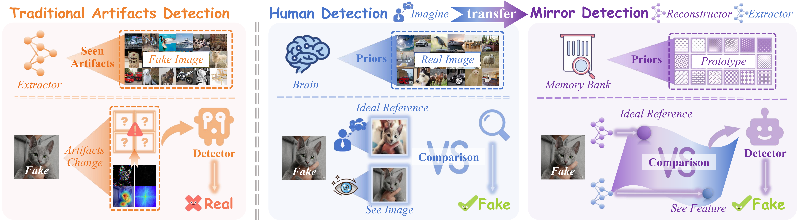

<div align="center">

# 🪞 MIRROR

### Manifold Ideal Reference ReconstructOR

**用于通用 AI 生成图像检测的"参考-比对"框架**

[](http://arxiv.org/abs/2602.02222)
[](LICENSE)
[](https://www.python.org/)
[](https://pytorch.org/)
[](https://github.com/handsome-rich/MIRROR)

[🇬🇧 English](README.md) · [📄 论文](http://arxiv.org/abs/2602.02222) · [📊 实验结果](#-性能表现) · [🚀 快速上手](#-快速上手) · [📚 引用](#-引用)



</div>

---

> *"知觉是一个假设检验的过程。"*
> &nbsp;&nbsp;&nbsp;&nbsp;Richard L. Gregory, 1980

**MIRROR** 重新定义了 AI 生成图像（AIGI）检测：放弃传统的"二分类找伪影"思路，将检测建模为一个 **Reference-Comparison（参考-比对）** 过程。框架显式编码 *真实图像* 所在流形：通过一个**可学习、正交**的 **Memory Bank（先验存储库）** 表征真实图像的稳定规律；每张输入图像通过稀疏 Top-$k$ 注意力被投影到该流形上，得到对应的 **Ideal Reference（理想参考）**；输入与理想参考之间的 **Comparison Residual（比对残差）** 即作为与生成器无关的检测信号。

这种范式带来了已有检测器所缺失的两个性质：

- 📈 **随骨干网络持续可扩展**：DINOv3 从 Base 放大到 Huge，准确率持续上升；NPR / UnivFD / DDA 则迅速饱和。
- 👁️ **超越人类感知极限**：在我们的 Human-AIGI 基准的 *人眼难以区分* 子集上，MIRROR 在 **27 个生成器** 上达到 **89.6%**，超过普通用户与 CV 专家。

---

## 📰 项目动态

- **2026.04** &nbsp;开源推理代码与 DINOv3-H+ 权重。
- **2026.03** &nbsp;论文发布于 arXiv。
- **即将发布** &nbsp;训练代码、完整 checkpoint zoo、Human-AIGI Benchmark 数据集。

---

## ✨ 核心亮点

| | |
|---|---|
| 🔄 **范式重构** | 用"参考-比对"取代"找伪影" |
| 🏆 **SOTA 表现** | 6 个标准基准平均 +2.1%，7 个野外基准平均 +8.1% |
| 👁️ **超越人类** | Human-AIGI 难样本子集 89.6%，超过普通用户 *与* CV 专家 |
| 📈 **可扩展性** | DINOv3 从 Base 到 Huge 持续提升，竞品饱和 |
| 🧠 **现实先验记忆库** | $K$ 个正交原型编码真实图像稳定规律 |
| 🔬 **首创基准** | 心理物理学策划的 Human-AIGI 数据集，50 名参与者，27 个生成器 |

---

## 🧭 方法概览

MIRROR 是一个两阶段框架（详见 `fig/method.pdf`）。

### 阶段 1 · 编码现实先验

冻结的 DINOv3 编码器仅在 *真实图像* 上提取 patch 级特征。可学习的正交原型存储库 $\mathbf{M} \in \mathbb{R}^{K \times D}$ 通过稀疏 Top-$k$ 交叉注意力的重建损失 + 正交正则项进行训练：

$$
\mathcal{L}_{\text{Phase1}} \;=\; \lVert F - \hat{F} \rVert_2^2 \;+\; \lambda \,\lVert \mathbf{M}\mathbf{M}^{\top} - \mathbf{I} \rVert_F
$$

第一项强制 $\hat{F}$ 忠实地重建真实图像流形；第二项保证原型彼此正交，避免冗余。

### 阶段 2 · 基于"参考-比对"的检测

冻结 $\mathbf{M}$ 后，每张输入图像通过相同的稀疏 Top-$k$ 注意力被投影到真实流形上，得到 Ideal Reference $\hat{F}$。真实图像与其参考高度对齐；AI 生成图像中的物理不一致性（光照、几何、纹理统计）无法被现实记忆解释，产生显著的 **comparison residual**。残差 + 重建 perplexity 共同决定最终检测分数。

---

## 📊 性能表现

所有数字均为 **平衡准确率（Balanced Accuracy, %）**，输入做了 PNG → JPG 格式对齐。

### 13 个标准 + 野外基准

| 类别 | Benchmark | 先前 SOTA | DINOv2-L | DINOv3-L | **DINOv3-H+** | Δ vs SOTA |
|---|---|---:|---:|---:|---:|---:|
| **标准基准** | AIGCDetectBenchmark | 84.7 (B-Free) | 90.5 | 91.7 | **97.3** | **+12.6** |
| | GenImage | 89.6 (B-Free) | 91.3 | 94.2 | **99.8** | **+10.2** |
| | UnivFakeDetect | 87.8 (B-Free) | 84.6 | 88.2 | **92.4** | **+4.6** |
| | Synthbuster | 96.5 (DDA) | 97.0 | 98.1 | **99.2** | **+2.7** |
| | EvalGEN | 96.6 (DDA) | 98.1 | 99.0 | **99.8** | **+3.2** |
| | DRCT-2M | 99.2 (B-Free) | 92.8 | 93.0 | 93.0 | −6.2 |
| **野外场景** | Chameleon | 83.5 (DDA) | 85.4 | 90.7 | **94.6** | **+11.1** |
| | SynthWildx | 94.6 (B-Free) | 88.9 | 93.1 | **95.1** | **+0.5** |
| | WildRF | 92.6 (B-Free) | 92.2 | 96.7 | **97.8** | **+5.2** |
| | AIGIBench | 84.4 (DDA) | 85.6 | 90.5 | **94.9** | **+10.5** |
| | CO-SPY | 80.3 (DDA) | 87.4 | 91.3 | **97.4** | **+17.1** |
| | RR-Dataset | 70.3 (DDA) | 76.8 | 78.9 | **88.3** | **+18.0** |
| | BFree-Online | 87.1 (B-Free) | 84.3 | 83.0 | **97.6** | **+10.5** |

> 综合：6 个标准基准平均 **+2.1%**，7 个野外基准平均 **+8.1%**（vs 上一代 SOTA）。

### Human-AIGI · 第 14 个基准

我们提出的心理物理学基准，覆盖 **27 个生成器**，并通过 50 名参与者的准确率、置信度与反应时间筛选出"人眼难以区分"的难样本子集，用于衡量检测器是否跨越 *Superhuman Crossover*。

| 方法 | 难样本子集准确率 (%) |
|---|---:|
| 普通用户 | ~ 55 |
| CV 专家（非鉴伪专业） | ~ 73 |
| **MIRROR (DINOv3-H+)** | **89.6** |

详细心理物理结果与每个生成器的明细见论文。

---

## 🛣️ 项目进度

- [x] 推理代码
- [x] DINOv3-H+ 推理权重
- [ ] 训练流程（阶段 1 + 阶段 2）
- [ ] 完整 checkpoint zoo（DINOv2-L / DINOv3-L / DINOv3-H+）
- [ ] Human-AIGI Benchmark 公开发布

---

## 🚀 快速上手

### 1. 环境配置

推荐 Python 3.10+。

```bash
git clone https://github.com/handsome-rich/MIRROR.git
cd MIRROR

# 请先根据 CUDA 版本从 https://pytorch.org 安装 torch
pip install torch torchvision tqdm pillow numpy scikit-learn transformers peft
```

### 2. 下载权重

| 文件 | 用途 | 链接 |
|---|---|---|
| `checkpoint-h-cur.pth` | 阶段 2 检测器 checkpoint | [Google Drive](https://drive.google.com/file/d/1gos1QgZA4Xuj706oa5i5E6vsOAoaLyr3/view?usp=sharing) |
| `mirror_phase1.pth` | 阶段 1 Memory Bank 权重 | [Google Drive](https://drive.google.com/file/d/1CpgltI-F7JN7hDyk2O16Ix3Zr_2d2-G0/view?usp=sharing) |
| `dinov3-huge/` | DINOv3-H+ 骨干权重 | [DINOv3 官方仓库](https://github.com/facebookresearch/dinov3) |

请将所有权重统一放入 `weight/`：

```text
weight/
├── checkpoint-h-cur.pth        # 阶段 2 检测器
├── mirror_phase1.pth           # 阶段 1 Memory Bank
└── dinov3-huge/                # DINOv3-Huge 骨干
    ├── config.json
    └── model.safetensors
```

### 3. 一键推理

```bash
python inference.py \
  --model_path     ./weight/checkpoint-h-cur.pth \
  --memory_path    ./weight/mirror_phase1.pth \
  --backbone_path  ./weight/dinov3-huge \
  --base_data_path /path/to/your/dataset \
  --benchmarks     Chameleon \
  --batch_size 128 \
  --device cuda \
  --use_amp
```

### 4. 数据集结构

`--base_data_path` 指向所有 benchmark 的根目录，每个子文件夹对应一个 benchmark：

```text
base_data_path/
├── AIGC_bm/                # AIGCDetectBenchmark
├── UniversalFakeDetect/    # UnivFD
├── synthbuster/            # Synthbuster
├── GenEval-JPEG/           # EvalGEN
├── Chameleon/test/
├── WildRF/test/
├── synthwildx/
├── AIGIBench/
├── CO-SPY-In-the-Wild/
├── drct/
├── RRDataset/
└── B-Free/
```

---

## ⚙️ 推理参数

| 参数 | 类型 | 说明 |
|---|---|---|
| `--model_path` | str | 阶段 2 checkpoint（`.pth`） |
| `--memory_path` | str | 阶段 1 Memory Bank 权重 |
| `--backbone_path` | str | DINOv3 骨干权重目录 |
| `--base_data_path` | str | 数据集根目录（包含各 benchmark 子文件夹） |
| `--benchmarks` | list | 待评估的 benchmark 列表，如 `Chameleon GenImage` |
| `--batch_size` | int | 单卡批大小 |
| `--device` | str | `cuda` 或 `cpu` |
| `--use_amp` | flag | 启用混合精度推理 |
| `--output_dir` | str | CSV 输出目录（默认 `./results`） |

CSV 报告路径为 `results/{benchmark}_{timestamp}.csv`，包含 `Acc / Bal_Acc / Real_Acc / Fake_Acc`。

---

## 📚 引用

如果 MIRROR 对你的研究有帮助，欢迎引用：

```bibtex
@article{liu2026mirror,
  title   = {MIRROR: Manifold Ideal Reference ReconstructOR for Generalizable AI-Generated Image Detection},
  author  = {Liu, Ruiqi and Cui, Manni and Qin, Ziheng and Yan, Zhiyuan and Chen, Ruoxin and Han, Yi and Li, Zhiheng and Chen, Junkai and Chen, ZhiJin and Lin, Kaiqing and others},
  journal = {arXiv preprint arXiv:2602.02222},
  year    = {2026}
}
```

---

## 📬 联系方式

- **Issues** &nbsp;[github.com/handsome-rich/MIRROR/issues](https://github.com/handsome-rich/MIRROR/issues)
- **Email** &nbsp;`ruiqi.liu24@nlpr.ia.ac.cn`

---

<div align="center">
<sub>🪞 我们相信：<em>理解真实</em> 比 <em>追逐伪造</em> 更具泛化能力。</sub>
</div>
